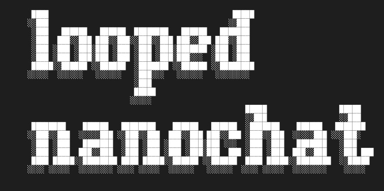

# looped nanochat




This project develops a **looped (depth-recurrent) transformer architecture** that scales test-time compute by iterating a recurrent block in latent space, rather than producing more tokens (like Chain-of-Thought). This allows the model to "think" in continuous high-dimensional space before emitting each token.

## Architecture

Follows Huginn architecture (Geiping et al., 2025). Some experiments were already done by [Trelis Research](https://github.com/TrelisResearch/nanochat/tree/recursive) but we start from scratch.

Three-stage looped transformer: **prelude** (2 layers) → **recur** (4 layers, iterated *r* times) → **coda** (2 layers).

At each recurrence the prelude output is re-injected into the recurrent state via a learned `inject` layer (identity-initialized). The recurrence count *r* is sampled from a Poisson log-normal distribution (mean=4, max=16) during training to encourage generalization across iteration depths. Gradients are truncated to the last `bptt_k=4` recurrences.

`Size` parameter is the single scaling dial: `model_dim = size × 64`, nudged up to the nearest multiple of `head_dim=128`. At the defaults (s20, r=4) the model matches the original nanochat in FLOPs (ISOFLOPs).

### Changes compared to Trelis
- Sandwich norm + norm at end of recurrent block (see Huginn)
- Trainable RMSNorm
- Sliding window attention in recursive block (SSSL)
- Value embeddings in recursive block (from current nanochat architecture; planned)
- Start with random normal instead of duplicate prelude output in input injection (see Huginn; planned)

## Training Pipeline

| Stage | Script | Description |
|-------|--------|-------------|
| 1 | `base_train` | Next-token prediction on web text. Training budget set by param-data ratio (default 4×). CORE evaluated periodically. |
| 2 | `chat_sft` | SFT on ~856K-row mixture: SmolTalk 460K, MMLU 100K, GSM8K 16K (×2ep), identity 2K (×2ep), SimpleSpelling 200K, SpellingBee 80K. Single epoch, bestfit-pad packing. |
| 3 | `chat_rl` | Simplified GRPO on GSM8K. On-policy, no KL/trust region. Advantage = reward − mean(reward), DAPO-style token-level normalization. |

## Primary Metric: CORE

22-task composite benchmark from the DCLM paper, spanning world knowledge, language understanding, commonsense reasoning, symbolic problem solving, and reading comprehension. Raw task accuracies are centered against random-guessing baselines and averaged into a single score.

**Target: beat nanochat at CORE = 0.2565.**

## Original nanochat

This is a fork of [karpathy/nanochat](https://github.com/karpathy/nanochat).

nanochat is the simplest experimental harness for training LLMs. It is designed to run on a single GPU node, the code is minimal/hackable, and it covers all major LLM stages including tokenization, pretraining, finetuning, evaluation, inference, and a chat UI. For example, you can train your own GPT-2 capability LLM (which cost ~$50,000 to train in 2019) for only $73 (3 hours of 8XH100 GPU node) and then talk to it in a familiar ChatGPT-like web UI.

For questions about the repo, I recommend either using [DeepWiki](https://deepwiki.com/karpathy/nanochat) from Devin/Cognition to ask questions about the repo, or use the [Discussions tab](https://github.com/karpathy/nanochat/discussions), or come by the [#nanochat](https://discord.com/channels/1020383067459821711/1427295580895314031) channel on Discord.

## File structure

```
.
├── LICENSE
├── README.md
├── dev
│   ├── gen_synthetic_data.py       # Example synthetic data for identity
│   ├── generate_logo.html
│   ├── nanochat.png
│   └── repackage_data_reference.py # Pretraining data shard generation
├── nanochat
│   ├── __init__.py                 # empty
│   ├── checkpoint_manager.py       # Save/Load model checkpoints
│   ├── common.py                   # Misc small utilities, quality of life
│   ├── core_eval.py                # Evaluates base model CORE score (DCLM paper)
│   ├── dataloader.py               # Tokenizing Distributed Data Loader
│   ├── dataset.py                  # Download/read utils for pretraining data
│   ├── engine.py                   # Efficient model inference with KV Cache
│   ├── execution.py                # Allows the LLM to execute Python code as tool
│   ├── flash_attention.py          # Flash attention implementation
│   ├── gpt.py                      # The GPT nn.Module Transformer
│   ├── logo.svg
│   ├── loss_eval.py                # Evaluate bits per byte (instead of loss)
│   ├── optim.py                    # AdamW + Muon optimizer, 1GPU and distributed
│   ├── report.py                   # Utilities for writing the nanochat Report
│   ├── tokenizer.py                # BPE Tokenizer wrapper in style of GPT-4
│   └── ui.html                     # HTML/CSS/JS for nanochat frontend
├── pyproject.toml
├── scripts
│   ├── base_eval.py                # Base model: CORE score, bits per byte, samples
│   ├── base_train.py               # Base model: train
│   ├── chat_cli.py                 # Chat model: talk to over CLI
│   ├── chat_eval.py                # Chat model: eval tasks
│   ├── chat_rl.py                  # Chat model: reinforcement learning
│   ├── chat_sft.py                 # Chat model: train SFT
│   ├── chat_web.py                 # Chat model: talk to over WebUI
│   ├── tok_eval.py                 # Tokenizer: evaluate compression rate
│   └── tok_train.py                # Tokenizer: train it
├── slurm
│   ├── chat_eval.sbatch            # SLURM job: chat evaluation
│   ├── chat_rl.sbatch              # SLURM job: reinforcement learning
│   ├── chat_sft.sbatch             # SLURM job: supervised fine-tuning
│   ├── download_hf_checkpoints.sbatch # SLURM job: download HF checkpoints
│   └── scaling_laws.sbatch         # SLURM job: scaling law experiments
├── tasks
│   ├── arc.py                      # Multiple choice science questions
│   ├── common.py                   # TaskMixture | TaskSequence
│   ├── customjson.py               # Make Task from arbitrary jsonl convos
│   ├── gsm8k.py                    # 8K Grade School Math questions
│   ├── humaneval.py                # Misnomer; Simple Python coding task
│   ├── mmlu.py                     # Multiple choice questions, broad topics
│   ├── smoltalk.py                 # Conglomerate dataset of SmolTalk from HF
│   └── spellingbee.py              # Task teaching model to spell/count letters
└── uv.lock
```

## Cite

If you find nanochat helpful in your research cite simply as:

```bibtex
@misc{nanochat,
  author = {Andrej Karpathy},
  title = {nanochat: The best ChatGPT that $100 can buy},
  year = {2025},
  publisher = {GitHub},
  url = {https://github.com/karpathy/nanochat}
}
```

## License

MIT
